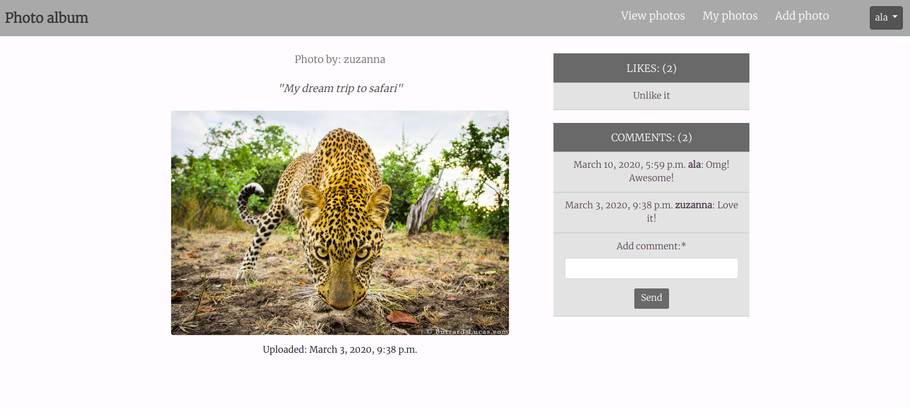
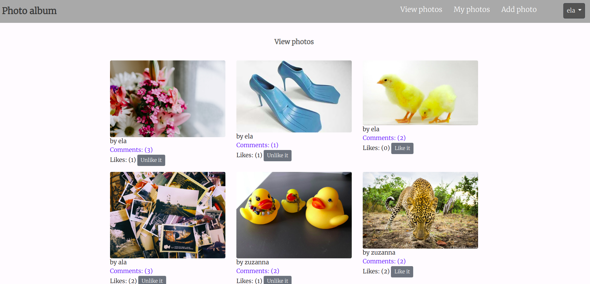

# photoalbum_app
Image sharing platform that provides easy way to display photos, comment on them and like them. If you are overwhelmed by Instagram - this app is for you :)

## How does it look like

Detailed photo view

<p align="center">

</p>

All photos view

<p align="center">

</p>


## How to get it up and running

### Before you start

Create virtualenv

If you don't have PostgreSQL installed, install it here:

[Install PostgreSQL and create a user](https://www.postgresql.org/download/)


### Getting Started

Install dependencies to your virtualenv, using requirements.txt

```
pip install -r requirements.txt
```

Create new database in PostgreSQL

Create new .py file in photoalbum/photoalbum folder and name it local_settings.py

Paste there the below:

```
SECRET_KEY = ''

DATABASES = {
    'default': {
        'ENGINE': 'django.db.backends.postgresql',
        'NAME': '',
        'HOST': '',
        'PASSWORD': '',
        'USER': '',
    }
}

```
Fill in missing parameteres with your secret key and your database credentials.


#### Installing

While in directory:

```
photoalbum/album_photo
```

Run migrations:

```
python3 manage.py migrate
```
Run server

```
python3 manage.py runserver
```

## Built With

* [Python 3.6](https://www.python.org/)
* [Django 3.0](https://www.djangoproject.com/)  - high-level Python Web framework that encourages rapid development and clean, pragmatic design.
* [django-crispy-forms](https://github.com/django-crispy-forms/django-crispy-forms) - lets you control the rendering behavior of your Django forms in a very elegant and DRY way 
* [Bootstrap4](https://getbootstrap.com/) - open source toolkit for developing with HTML, CSS, and JS.
* [PostgreSQL](https://www.postgresql.org/) -  open source object-relational database system

## Author

[ZuzannaP](https://github.com/ZuzannaP)

## License

This project is licensed under the GNU AFFERO GENERAL PUBLIC LICENSE - see the [LICENSE.md](https://github.com/ZuzannaP/shall_we_meet_app/blob/master/LICENSE) file for details

